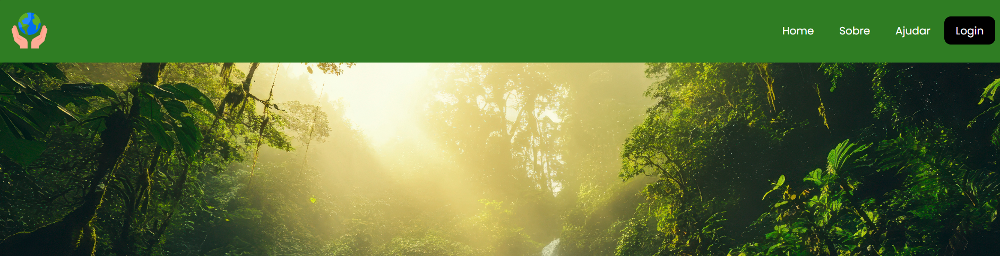
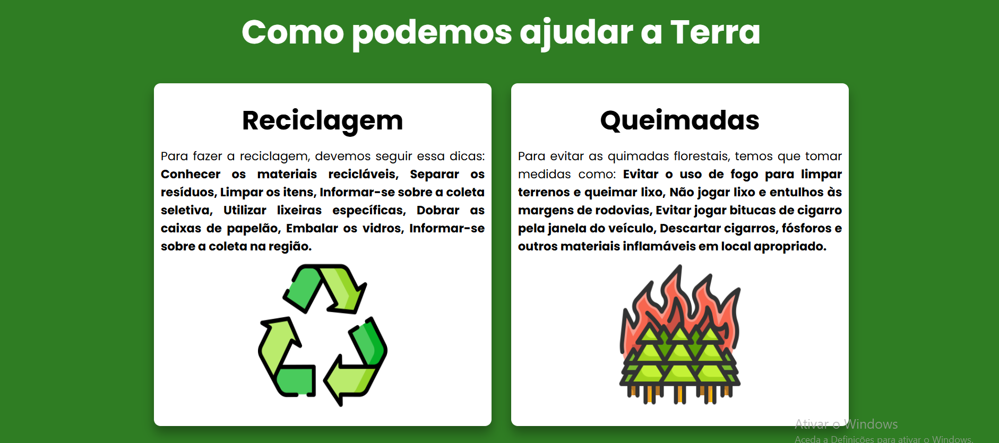
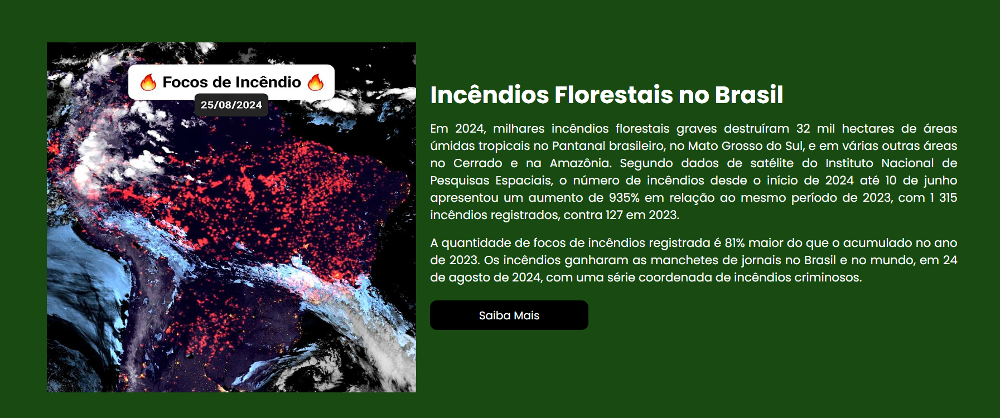
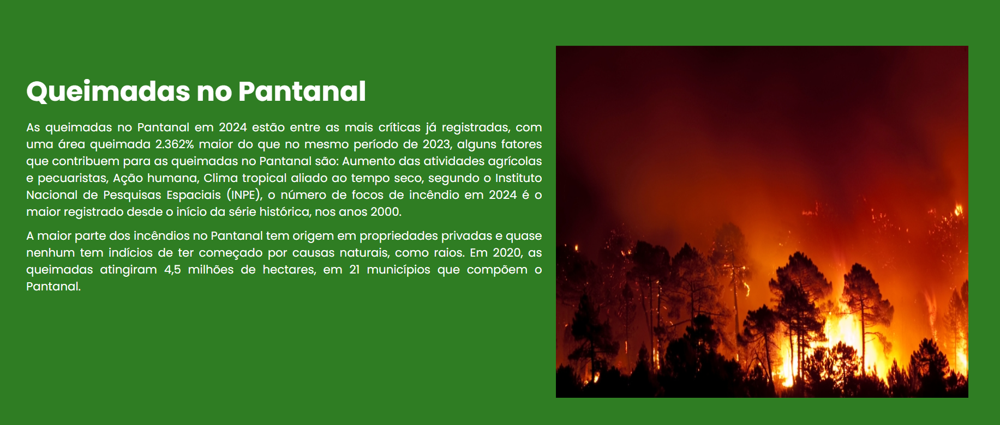
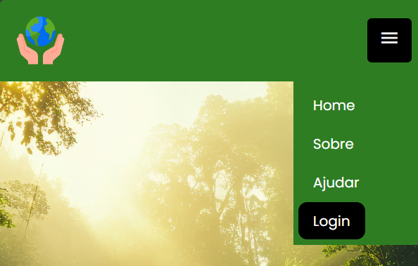

# Earth Life 🌍
Bem vindo, nosso site oferece dicas e informações de como podemos ajudar o nosso planeta contra o desmatamento, poluições e os focos de incêndios, só assim evitaremos mais desmatamento e incêndios nas florestas, poluições no ar e nos oceanos, assim manteremos nosso meio ambiente firme e forte futuramente.

## Data
01/09/2024 || Ultima atualização: 05/11/2024

## Capturas

  
  
  
  
  
   

